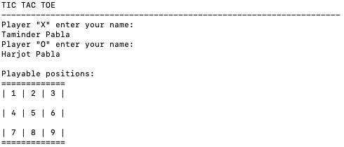
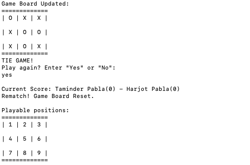
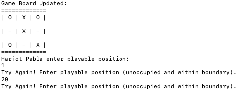
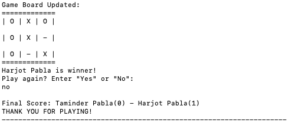

# Tic Tac Toe
[](https://github.com/taminderpabla)


[](https://github.com/taminderpabla/tic-tac-toe)

Simple TicTacToe player-vs-player game that determines whether a game has ended based on tie or win conditions.
The score is tracked and displayed after each match has concluded.

The players have the opportunity to continue gameplay through a rematch or stop which displays the cumulative score 
after all matches.

## Requirements
Requires no specification.

## Running From Command Line
### TicTacToe Execution
Basic GamePlay Operations:
- Initializing each player's name
- Displaying board with playable positions numbered 1-9
- Displaying unoccupied board positions as "-" 
- Updating board after each valid move
- Determining result (Tie or Win) after each move
- Tracking player scores
- Option to replay or stop gameplay after each match

### Gameplay Results (via Terminal)


_**Figure 1:** Displaying playable positions on game board_



_**Figure 2:** Result after single match and tie condition_



_**Figure 3:** Player enters invalid position, occupied or out of bounds_



_**Figure 4:** Result after two matches and player win condition_

### Execution Procedure
Instructions to play the game through command line:
1. Clone the repository (shown using SSH):
```
    $ git clone git@github.com:taminderpabla/tic-tac-toe.git
```
2. Compile all Java files (found in 'src' folder):
```
    % javac *.java
```
3. Execute the program (game will start by running Main): 
```
    % java Main
```